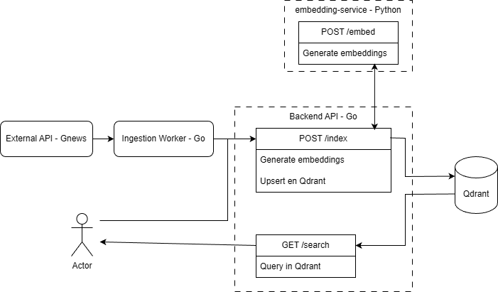
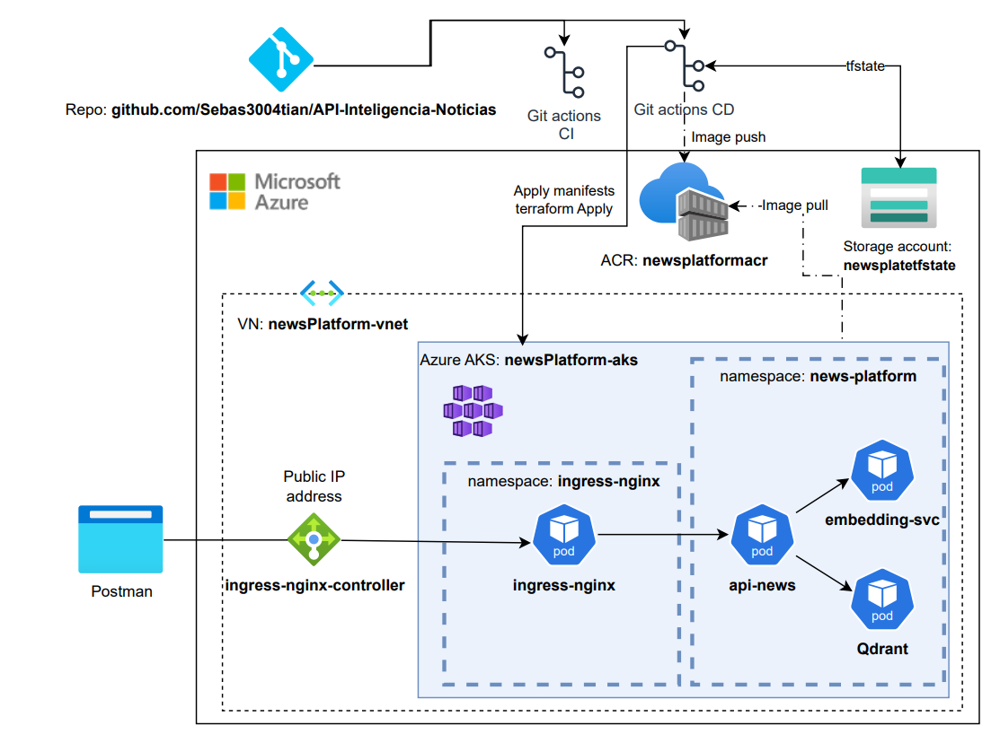

# API-Inteligencia-Noticias
Pipeline de ingesta, embeddings y búsqueda semántica

Este proyecto implementa un sistema completo para ingerir artículos de noticias, generar representaciones vectoriales (embeddings), almacenarlas en una base de datos vectorial (Qdrant) y permitir búsquedas semánticas mediante una API REST.

La solución está construida en Go y Python, con una arquitectura modular compuesta por:

- **api-news** → Backend principal en Go  
- **embedding-service** → Servicio de embeddings en Python  
- **ingest** → Worker de ingesta y preparación de datos  
- **doc** → Diagramas y documentación

---

# Objetivo del Proyecto

Construir un backend escalable capaz de:

1. **Ingerir artículos de noticias** desde una fuente externa  
2. **Generar embeddings semánticos** del contenido  
3. **Indexar y almacenar** dicha información en Qdrant  
4. **Exponer una API REST** para búsquedas por similitud semántica  

El sistema está diseñado siguiendo principios de separación de responsabilidades y arquitectura limpia.

---

# Arquitectura General



### Flujo resumido

1. **Ingestion Worker (Go)** obtiene artículos desde *GNews API*  
2. Envía los artículos al **Backend API (/index)**  
3. El Backend llama al **Embedding Service** para generar los vectores  
4. El Backend **inserta o actualiza** los embeddings en **Qdrant**  
5. Un usuario puede consultar por `/search` → Qdrant devuelve los más similares  

---

# Modelo de Embeddings

Este proyecto utiliza el modelo:
```
sentence-transformers/all-MiniLM-L6-v2
```

El embedding-service está construido sobre **FastAPI + Sentence Transformers**.

---

#  Estructura del Repositorio

```
.
├── api-news/ # Backend principal en Go (index + search)
├── embedding-service/ # Servicio Python para generar embeddings
├── ingest/ # Worker de ingesta desde GNews API
└── doc/ # Diagramas y documentación
```


---

# Ejecutar el Proyecto en Local

### Levantar Qdrant (WSL / Docker)
```bash
docker run -p 6333:6333 -p 6334:6334 \
  -v qdrant_data:/qdrant/storage \
  qdrant/qdrant
```

### Ejecutar el Embedding Service (Python)
Requerimientos:
```bash
pip install -r requirements.txt
```

Ejecutar:
```bash
uvicorn app:app --host 127.0.0.1 --port 9000
```

### Ejecutar el Backend API (Go)
Requerimientos:
```bash
go get github.com/joho/godotenv
go get github.com/gofiber/fiber/v2
go get github.com/qdrant/go-client/qdrant
```

Ejecutar:
```bash
go run ./cmd
```

### Ejecutar el Embedding Service (Python)
Requerimientos:
```bash
go get github.com/google/uuid
```


Ejecutar:
```bash
go run ./cmd/worker
```

#  Endpoints Disponibles

## POST /index
Recibe una lista de artículos para:

1. Generar embeddings (via embedding-service)
2. Insertarlos en Qdrant

### Ejemplo de body:
```json
[
  {
    "id": "001",
    "title": "Tesla lanza nuevo modelo",
    "description": "Mejoras en autonomía",
    "content": "Un carro eléctrico...",
    "url": "...",
    "image": "...",
    "published_at": "2025-11-29",
    "source_name": "GNews",
    "source_url": "..."
  }
]
```

## GET /search?query=tu+texto
Devuelve artículos más similares según embeddings almacenados.

### Ejemplo de respuesta:
```json
[
  {
    "id": "001",
    "score": 0.89,
    "item": {
      "title": "...",
      "description": "...",
      "content": "..."
    }
  }
]

```
# Actualmente
El proyecto cuenta con dos pipelines CI y CD:

## GitHub Actions (CI/CD)

### CI:

- Compila los servicios (api-news y embedding-service)
- Ejecuta pruebas
- Genera las imágenes Docker para comprobar

### CD:

- Hace push de imágenes al ACR

- Actualiza la infraestructura

- Aplica los manifests

Todo teniendo en cuenta si sufrio o no modificacion.

# Diagrama de la infraestructura actual



