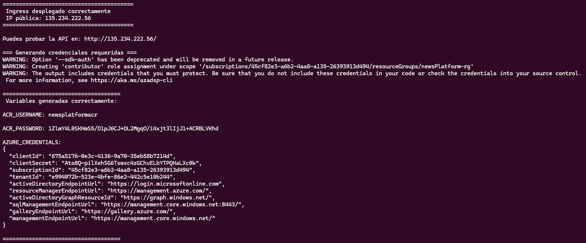

Una vez ejecutado todos los scripts tendremos nuestra ip publica:



# Deploy de la Plataforma de Noticias en Azure

Este proyecto utiliza **Terraform**, **Docker**, **Azure Container Registry (ACR)** y **Azure Kubernetes Service (AKS)** para desplegar una arquitectura completa en la nube.

A continuación encontrarás los comandos necesarios para desplegar o destruir la infraestructura de forma ordenada.

---

##  1. Autenticación en Azure

Antes de ejecutar cualquier script, debes iniciar sesión:

```bash
az login
```

---

##  2. Asignar permisos de ejecución a los scripts

```bash
chmod +x 1.deploy_infra.sh
chmod +x 2.push_images.sh
chmod +x 3.deploy_k8s.sh
```

---

##  3. Despliegue completo  
(Incluye Infraestructura + Push de Imágenes + Deploy en Kubernetes)

Ejecuta los scripts en orden:

```bash
./1.deploy_infra.sh
./2.push_images.sh
./3.deploy_k8s.sh
```

---

##  4. Destruir toda la infraestructura

Para limpiar completamente tu entorno:

```bash
chmod +x destroy_infra.sh
./destroy_infra.sh
```

---

##  ¡Listo!
